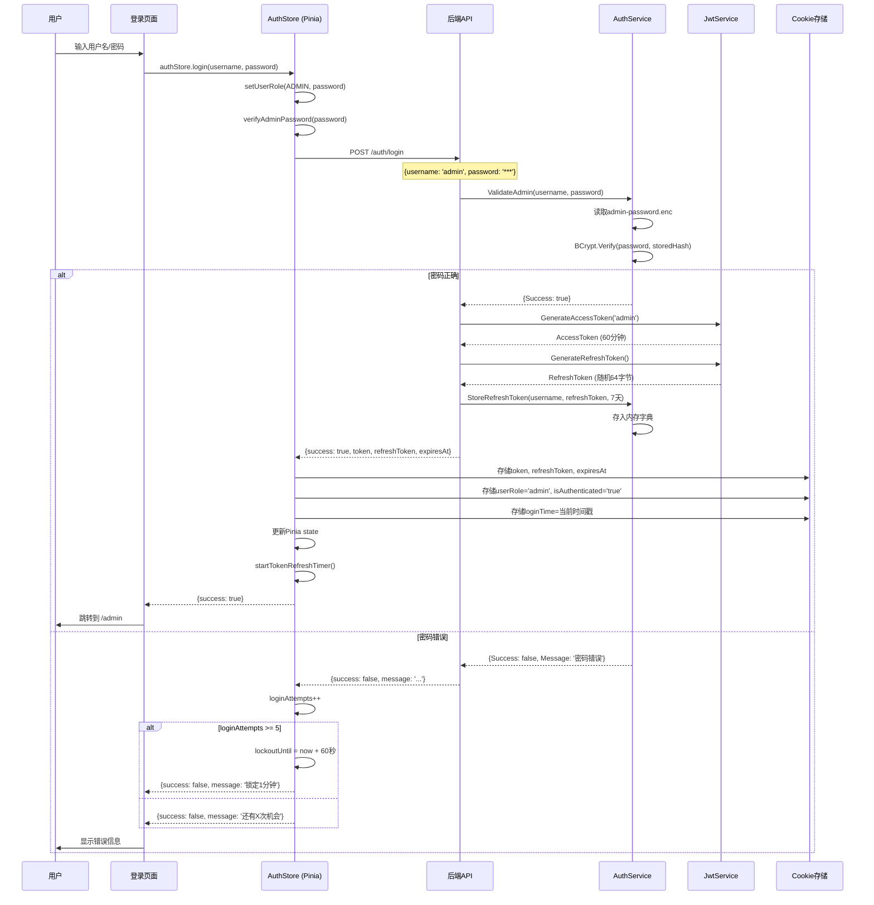
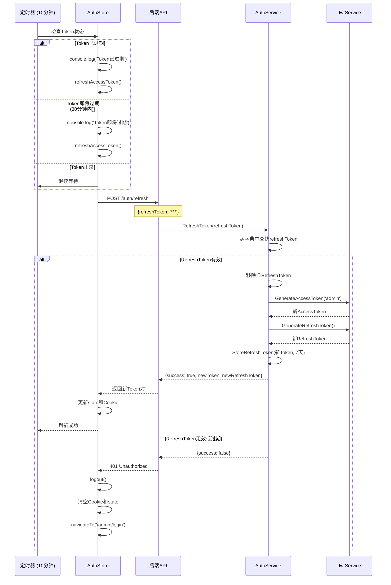
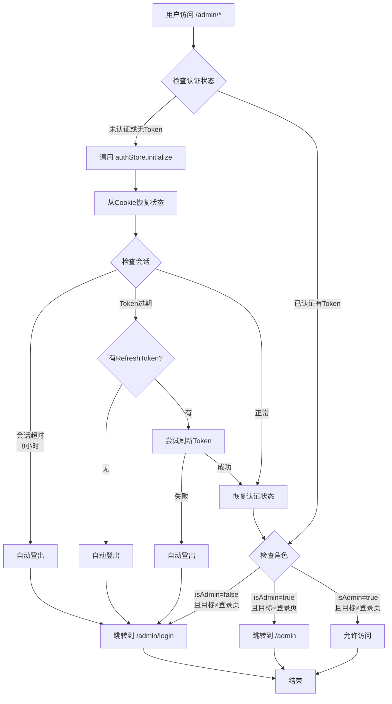
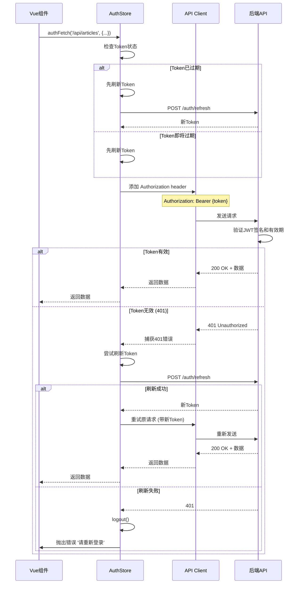
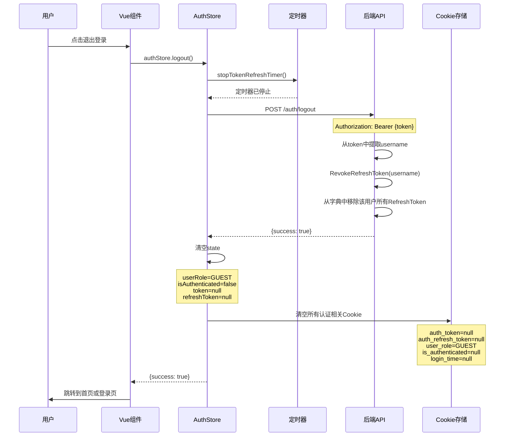

# 博客系统管理员身份认证详细文档

> 📅 创建时间：2026年2月20日  
> 🎯 目标：详细记录本项目前端身份认证的实现机制、安全策略及技术细节

---

## 📋 目录

1. [认证系统架构概览](#认证系统架构概览)
2. [核心组件说明](#核心组件说明)
3. [完整认证流程](#完整认证流程)
4. [前端状态存储机制](#前端状态存储机制)
5. [Token刷新机制](#token刷新机制)
6. [路由保护机制](#路由保护机制)
7. [API请求认证](#api请求认证)
8. [安全性分析](#安全性分析)
9. [参考文档](#参考文档)

---

## 认证系统架构概览

本项目采用 **JWT (JSON Web Token) + RefreshToken 双Token认证机制**，结合前端Cookie存储和Pinia状态管理，实现了安全可靠的管理员身份认证系统。

### 技术栈

- **前端框架**: Nuxt 3 + Vue 3 + TypeScript
- **状态管理**: Pinia
- **存储方案**: Cookie (非HttpOnly) + Pinia Store
- **后端框架**: .NET 8 Web API
- **密码加密**: BCrypt
- **Token生成**: JWT (HMAC-SHA256)

### 架构特点

✅ **双Token机制**: AccessToken（短期）+ RefreshToken（长期）  
✅ **自动刷新**: 后台定时器主动刷新Token  
✅ **无感续期**: 用户无需重复登录  
✅ **防重放攻击**: Token有效期限制 + RefreshToken Rotation  
✅ **登录限制**: 连续5次失败锁定1分钟  
✅ **会话超时**: 8小时后自动登出  

---

## 核心组件说明

### 前端组件

| 文件路径 | 作用 | 关键功能 |
|---------|------|---------|
| `nuxt/app/stores/auth.ts` | 认证状态管理 | 登录、登出、Token刷新、状态持久化 |
| `nuxt/app/middleware/admin-auth.ts` | 路由守卫 | 保护管理后台路由，验证认证状态 |
| `nuxt/app/pages/admin/login.vue` | 登录页面 | 用户输入凭证，调用登录接口 |
| `nuxt/app/pages/admin/password.vue` | 修改密码页面 | 管理员修改密码 |

### 后端组件

| 文件路径 | 作用 | 关键功能 |
|---------|------|---------|
| `backend-dotnet/BlogApi/Controllers/AuthController.cs` | 认证控制器 | 登录、刷新、登出、修改密码接口 |
| `backend-dotnet/BlogApi/Services/AuthService.cs` | 认证服务 | 密码验证、RefreshToken管理 |
| `backend-dotnet/BlogApi/Services/JwtService.cs` | JWT服务 | 生成和验证JWT Token |
| `backend-dotnet/BlogApi/admin-password.enc` | 密码存储 | BCrypt哈希密码文件 |

---

## 完整认证流程

### 1️⃣ 用户登录流程



### 2️⃣ Token自动刷新流程



### 3️⃣ 路由守卫流程



### 4️⃣ API请求认证流程



### 5️⃣ 用户登出流程



---

## 前端状态存储机制

### Cookie 存储方案

前端使用 **Cookie** 作为主要的持久化存储方案，配合 Pinia 实现响应式状态管理。

#### 存储的Cookie键值

| Cookie Key | 说明 | 过期时间 | 示例值 |
|-----------|------|---------|--------|
| `auth_token` | JWT AccessToken | 7天 | `eyJhbGciOiJIUzI1NiIs...` |
| `auth_refresh_token` | RefreshToken | 30天 | `xQ7mK9pL3eR8tY2nW...` |
| `auth_token_expires` | Token过期时间戳 | 7天 | `2026-02-20T15:30:00Z` |
| `user_role` | 用户角色 | 7天 | `admin` 或 `guest` |
| `is_authenticated` | 认证状态标识 | 7天 | `true` 或 `null` |
| `login_time` | 登录时间戳 (ms) | 7天 | `1708441200000` |

#### Cookie 配置代码

```typescript
// nuxt/app/stores/auth.ts
_getCookies(): AuthCookies {
  const cookieOpts = (maxAge: number) => ({ 
    maxAge, 
    decode: (v: string) => v,  // 禁用自动解码
    encode: (v: string) => v   // 禁用自动编码
  })
  
  return {
    token: useCookie(TOKEN_KEY, cookieOpts(60 * 60 * 24 * 7)),       // 7天
    refreshToken: useCookie(REFRESH_TOKEN_KEY, cookieOpts(60 * 60 * 24 * 30)), // 30天
    tokenExpires: useCookie(TOKEN_EXPIRES_KEY, cookieOpts(60 * 60 * 24 * 7)),
    userRole: useCookie(USER_ROLE_KEY, cookieOpts(60 * 60 * 24 * 7)),
    isAuthenticated: useCookie(IS_AUTHENTICATED_KEY, cookieOpts(60 * 60 * 24 * 7)),
    loginTime: useCookie(LOGIN_TIME_KEY, cookieOpts(60 * 60 * 24 * 7))
  }
}
```

#### 为什么使用 Cookie？

**优点**：
1. ✅ **持久化存储**: 页面刷新不丢失认证状态
2. ✅ **跨标签共享**: 同一域名下的多个标签页共享登录状态
3. ✅ **SSR兼容**: Nuxt 3的`useCookie`支持服务端渲染
4. ✅ **自动过期**: 可设置maxAge自动清理
5. ✅ **原生支持**: 无需额外依赖localStorage或sessionStorage

**当前实现的不足**：
- ⚠️ **未设置HttpOnly**: Cookie可被JavaScript读取，存在XSS风险
- ⚠️ **未设置Secure**: 未强制HTTPS传输
- ⚠️ **未设置SameSite**: 缺少CSRF保护

### Pinia 状态管理

除了Cookie持久化，前端同时在 Pinia Store 中维护响应式状态：

```typescript
// nuxt/app/stores/auth.ts
state: (): AuthState => ({
  userRole: UserRoles.GUEST,           // 当前用户角色
  isAuthenticated: false,              // 是否已认证
  loginAttempts: 0,                    // 登录失败次数
  lockoutUntil: 0,                     // 锁定截止时间戳
  token: null,                         // AccessToken
  refreshToken: null,                  // RefreshToken
  tokenExpiresAt: null,                // Token过期时间
  tokenRefreshTimer: null              // 后台定时器引用
})
```

#### Getters (计算属性)

```typescript
getters: {
  isAdmin: (state) => state.userRole === UserRoles.ADMIN && state.isAuthenticated,
  isGuest: (state) => state.userRole === UserRoles.GUEST,
  isLocked: (state) => state.lockoutUntil > Date.now(),
  authHeaders: (state) => state.token ? { Authorization: `Bearer ${state.token}` } : {},
  isTokenExpiringSoon: (state) => {
    // 30分钟内即将过期
    return state.tokenExpiresAt && 
           new Date(state.tokenExpiresAt).getTime() - Date.now() < 30 * 60 * 1000
  },
  isTokenExpired: (state) => {
    return !state.tokenExpiresAt || 
           new Date(state.tokenExpiresAt).getTime() < Date.now()
  }
}
```

### 状态恢复机制 (initialize)

当应用启动或页面刷新时，`initialize()` 方法负责从Cookie恢复认证状态：

```typescript
async initialize(): Promise<void> {
  if (!import.meta.client) return  // 仅在客户端执行

  const cookies = this._getCookies()
  
  // 1. 读取Cookie中的数据
  const savedToken = cookies.token.value
  const savedRefreshToken = cookies.refreshToken.value
  const savedLoginTime = cookies.loginTime.value
  
  // 2. 检查会话超时 (8小时)
  const SESSION_TIMEOUT = 8 * 60 * 60 * 1000
  const isSessionExpired = Date.now() - parseInt(savedLoginTime || '0') > SESSION_TIMEOUT
  
  // 3. 检查Token是否过期
  const isTokenExpired = cookies.tokenExpires.value && 
                         new Date(cookies.tokenExpires.value).getTime() < Date.now()
  
  // 4. 处理过期情况
  if (isSessionExpired || isTokenExpired) {
    if (savedRefreshToken && !isSessionExpired) {
      // 尝试自动刷新Token
      const success = await this.refreshAccessToken()
      if (!success) {
        await this.logout()  // 刷新失败，登出
        return
      }
    } else {
      await this.logout()  // 会话过期，登出
      return
    }
  }
  
  // 5. 恢复状态到Pinia
  this.token = savedToken
  this.refreshToken = savedRefreshToken
  this.isAuthenticated = cookies.isAuthenticated.value === 'true'
  this.userRole = cookies.userRole.value as UserRole
  
  // 6. 启动后台定时器
  if (this.isAuthenticated && this.token) {
    this.startTokenRefreshTimer()
  }
}
```

---

## Token刷新机制

### 后台定时器策略

系统采用**主动刷新**策略，而非被动等待Token过期：

```typescript
// nuxt/app/stores/auth.ts
startTokenRefreshTimer(): void {
  if (!import.meta.client) return
  
  this.stopTokenRefreshTimer()  // 先清除旧定时器
  
  this.tokenRefreshTimer = setInterval(async () => {
    if (!this.isAuthenticated || !this.token) {
      this.stopTokenRefreshTimer()
      return
    }
    
    if (this.isTokenExpired) {
      console.log('[Auth] Token已过期，尝试刷新...')
      const success = await this.refreshAccessToken()
      if (!success) {
        console.log('[Auth] 刷新失败，退出登录')
        await this.logout()
      }
    } else if (this.isTokenExpiringSoon) {
      console.log('[Auth] Token即将过期，主动刷新...')
      await this.refreshAccessToken()
    }
  }, 10 * 60 * 1000)  // 每10分钟检查一次
}
```

### 刷新时机

| 时机 | 触发条件 | 说明 |
|-----|---------|------|
| **定时检查** | 每10分钟 | 后台定时器主动检查Token状态 |
| **Token已过期** | `expiresAt < now` | 立即刷新 |
| **Token即将过期** | `expiresAt - now < 30分钟` | 主动刷新，提前续期 |
| **API请求前** | 发起authFetch前 | 确保请求时Token有效 |
| **401错误后** | 收到Unauthorized | 尝试刷新后重试一次 |

### RefreshToken Rotation

后端实现了 **RefreshToken轮换机制**，每次刷新都会：

1. ✅ 验证旧RefreshToken的有效性
2. ✅ 生成新的AccessToken和RefreshToken
3. ✅ **移除旧RefreshToken**（防止重放）
4. ✅ 存储新RefreshToken到字典

```csharp
// backend-dotnet/BlogApi/Services/AuthService.cs
public AuthResponse RefreshToken(string refreshToken, JwtService jwtService)
{
    if (!_refreshTokens.TryGetValue(refreshToken, out var tokenInfo))
        return new AuthResponse { Success = false, Message = "无效的 Refresh Token" };
    
    if (tokenInfo.ExpiresAt < DateTime.UtcNow)
    {
        _refreshTokens.TryRemove(refreshToken, out _);  // 清理过期token
        return new AuthResponse { Success = false, Message = "Refresh Token 已过期" };
    }
    
    // 移除旧token
    _refreshTokens.TryRemove(refreshToken, out _);
    
    // 生成新token
    var newAccessToken = jwtService.GenerateAccessToken(tokenInfo.Username);
    var newRefreshToken = jwtService.GenerateRefreshToken();
    
    // 存储新token
    StoreRefreshToken(tokenInfo.Username, newRefreshToken, jwtService.GetRefreshTokenExpiration());
    
    return new AuthResponse { 
        Success = true, 
        Token = newAccessToken, 
        RefreshToken = newRefreshToken 
    };
}
```

---

## 路由保护机制

### 中间件配置

管理后台所有路由通过 `admin-auth.ts` 中间件保护：

```typescript
// nuxt/app/middleware/admin-auth.ts
export default defineNuxtRouteMiddleware(async (to) => {
  if (!import.meta.client) return  // 仅在客户端执行

  const authStore = useAuthStore()

  // 如果未认证，先尝试从Cookie恢复状态
  if (!authStore.isAuthenticated || !authStore.token) {
    await authStore.initialize()
  }

  // 未认证用户访问非登录页 -> 跳转到登录页
  if (!authStore.isAdmin && to.path !== '/admin/login') {
    console.log('[Admin Auth] 未认证，重定向到登录页')
    return navigateTo('/admin/login')
  }

  // 已认证用户访问登录页 -> 跳转到管理后台
  if (authStore.isAdmin && to.path === '/admin/login') {
    console.log('[Admin Auth] 已认证，重定向到管理后台')
    return navigateTo('/admin')
  }
})
```

### 页面级应用

在管理后台的页面中使用：

```vue
<!-- nuxt/app/pages/admin/articles/index.vue -->
<script setup lang="ts">
definePageMeta({
  middleware: 'admin-auth',  // 应用认证中间件
  layout: 'admin'            // 使用管理后台布局
})
</script>
```

### 保护效果

- ✅ 未登录用户访问 `/admin/*` → 自动跳转到 `/admin/login`
- ✅ 已登录用户访问 `/admin/login` → 自动跳转到 `/admin`
- ✅ Token过期自动检测 → 尝试刷新或登出
- ✅ 会话超时检测 → 强制重新登录

---

## API请求认证

### authFetch 封装

前端封装了 `authFetch` 方法，自动处理Token添加和刷新：

```typescript
// nuxt/app/stores/auth.ts
async authFetch<T>(url: string, options: AuthFetchOptions = {}): Promise<T> {
  const api = createApiClient()
  
  // ===== 1. 请求前检查Token状态 =====
  if (this.isTokenExpired && this.refreshToken) {
    console.log('[Auth] Token已过期，请求前先刷新')
    const refreshed = await this.refreshAccessToken()
    if (!refreshed) {
      throw new Error('Token已过期且刷新失败，请重新登录')
    }
  } else if (this.isTokenExpiringSoon && this.refreshToken) {
    console.log('[Auth] Token即将过期，请求前先刷新')
    await this.refreshAccessToken()
  }
  
  // ===== 2. 添加认证头 =====
  const fetchOptions = {
    ...options,
    headers: {
      ...options.headers,
      ...this.authHeaders  // { Authorization: 'Bearer xxx' }
    }
  }
  
  try {
    // ===== 3. 发送请求 =====
    return await api.request<T>(url, fetchOptions)
  } catch (error: unknown) {
    // ===== 4. 401错误处理 =====
    if (isFetchErrorLike(error) && error.response?.status === 401 && this.refreshToken) {
      console.log('[Auth] 收到401错误，尝试刷新Token并重试')
      const refreshed = await this.refreshAccessToken()
      if (refreshed) {
        // 更新请求头并重试
        fetchOptions.headers = {
          ...options.headers,
          ...this.authHeaders
        }
        return await api.request<T>(url, fetchOptions)
      }
      // 刷新失败，登出
      await this.logout()
      throw new Error('Token已失效，请重新登录')
    }
    throw error
  }
}
```

### 后端JWT验证

后端使用 `[Authorize]` 特性保护接口：

```csharp
// backend-dotnet/BlogApi/Controllers/ArticlesController.cs
[Authorize]  // 需要JWT验证
[HttpPost]
public async Task<ActionResult<Article>> CreateArticle([FromBody] ArticleDto dto)
{
    var username = User.Identity?.Name;  // 从JWT Claims中提取用户名
    // ...
}
```

JWT中间件配置 (在 `Program.cs` 中):

```csharp
builder.Services.AddAuthentication(JwtBearerDefaults.AuthenticationScheme)
    .AddJwtBearer(options =>
    {
        options.TokenValidationParameters = new TokenValidationParameters
        {
            ValidateIssuer = true,
            ValidateAudience = true,
            ValidateLifetime = true,          // 验证过期时间
            ValidateIssuerSigningKey = true,  // 验证签名
            ValidIssuer = builder.Configuration["Jwt:Issuer"],
            ValidAudience = builder.Configuration["Jwt:Audience"],
            IssuerSigningKey = new SymmetricSecurityKey(
                Encoding.UTF8.GetBytes(builder.Configuration["Jwt:SecretKey"])
            )
        };
    });
```

---

## 安全性分析

### 🛡️ 安全措施

#### 1. 密码安全

- ✅ **BCrypt哈希**: 使用BCrypt加密存储密码（工作因子默认10）
- ✅ **不可逆加密**: 即使数据库泄露，无法还原明文密码
- ✅ **盐值自动生成**: BCrypt自动为每个密码生成唯一盐值

```csharp
// 后端密码存储
var hashedPassword = BCrypt.Net.BCrypt.HashPassword(password);
File.WriteAllText(_passwordFilePath, hashedPassword);

// 后端密码验证
var storedHash = File.ReadAllText(_passwordFilePath);
bool isValid = BCrypt.Net.BCrypt.Verify(password, storedHash);
```

#### 2. Token安全

- ✅ **JWT签名验证**: HMAC-SHA256签名，防止篡改
- ✅ **Token有效期**: AccessToken 60分钟，限制暴露风险
- ✅ **RefreshToken轮换**: 每次刷新生成新token，旧token失效
- ✅ **JTI (JWT ID)**: 每个Token包含唯一ID
- ✅ **IAT (Issued At)**: 记录Token签发时间

```csharp
// JWT Claims
var claims = new[]
{
    new Claim(ClaimTypes.Name, username),
    new Claim(ClaimTypes.Role, "Admin"),
    new Claim(JwtRegisteredClaimNames.Jti, Guid.NewGuid().ToString()),
    new Claim(JwtRegisteredClaimNames.Iat, DateTimeOffset.UtcNow.ToUnixTimeSeconds().ToString())
};
```

#### 3. 暴力破解防护

- ✅ **登录失败限制**: 连续5次错误锁定1分钟
- ✅ **锁定倒计时**: 实时显示剩余锁定时间
- ⚠️ **仅前端实现**: 可被绕过（建议后端也实现）

```typescript
// 前端登录失败处理
this.loginAttempts++
if (this.loginAttempts >= 5) {
  this.lockoutUntil = Date.now() + 60 * 1000  // 1分钟
  this.loginAttempts = 0
  return { success: false, message: '账户已锁定1分钟' }
}
```

#### 4. 会话管理

- ✅ **会话超时**: 8小时后自动登出
- ✅ **主动刷新**: 提前30分钟刷新Token，用户无感知
- ✅ **登出撤销**: 登出时撤销服务器端的RefreshToken

```typescript
// 会话超时检查
const SESSION_TIMEOUT = 8 * 60 * 60 * 1000  // 8小时
const isSessionExpired = Date.now() - loginTime > SESSION_TIMEOUT
if (isSessionExpired) {
  await this.logout()
}
```

### ⚠️ 潜在风险与改进建议

#### 高优先级

| 风险 | 严重性 | 改进建议 |
|-----|-------|---------|
| **Cookie未设置HttpOnly** | 🔴 高 | 将Token存储在HttpOnly Cookie中，防止XSS窃取。前端通过服务端代理访问API。 |
| **无CSRF保护** | 🔴 高 | 添加CSRF Token或使用SameSite=Strict Cookie属性 |
| **RefreshToken存储在内存** | 🟡 中 | 迁移到Redis或数据库，支持多实例部署和持久化 |
| **登录限制仅前端** | 🟡 中 | 后端也实现登录失败限制，记录IP和时间 |

#### 中优先级

| 风险 | 严重性 | 改进建议 |
|-----|-------|---------|
| **无日志审计** | 🟡 中 | 记录登录/登出/密码修改等敏感操作日志 |
| **无IP白名单** | 🟢 低 | 允许配置管理员IP白名单 |
| **无多因素认证** | 🟢 低 | 增加TOTP或邮件验证码二次验证 |
| **密码策略弱** | 🟢 低 | 强制密码复杂度（大小写+数字+特殊字符） |

#### 详细改进方案

##### 1. HttpOnly Cookie + API代理

**当前问题**：  
前端JavaScript可直接读取Cookie中的Token，存在XSS攻击风险。

**改进方案**：  
```typescript
// 后端设置HttpOnly Cookie
Response.Cookies.Append("auth_token", token, new CookieOptions
{
    HttpOnly = true,      // JavaScript无法访问
    Secure = true,        // 仅HTTPS传输
    SameSite = SameSiteMode.Strict,  // 防止CSRF
    MaxAge = TimeSpan.FromHours(1)
});

// 前端通过Nuxt服务端代理发送请求
// Cookie会自动附加，无需前端处理
const data = await $fetch('/api/articles', {
  credentials: 'include'  // 自动包含Cookie
})
```

##### 2. CSRF保护

**方案一：双重提交Cookie**  
```typescript
// 后端生成CSRF Token
const csrfToken = randomBytes(32).toString('hex')
Response.Cookies.Append("csrf_token", csrfToken)
Response.Headers.Append("X-CSRF-Token", csrfToken)

// 前端在请求中提交
headers: {
  'X-CSRF-Token': getCookie('csrf_token')
}
```

**方案二：SameSite Cookie**  
```csharp
// 最简单的方案
CookieOptions { SameSite = SameSiteMode.Strict }
```

##### 3. Redis存储RefreshToken

```csharp
// 使用Redis代替内存字典
await _redis.StringSetAsync(
    $"refresh_token:{username}",
    refreshToken,
    expiry: TimeSpan.FromDays(7)
);

// 支持多实例部署，服务重启不丢失
```

##### 4. 后端登录限制

```csharp
// 记录登录失败
_cache.Set($"login_attempts:{ip}", attempts, TimeSpan.FromMinutes(10));

if (attempts >= 5)
{
    return Unauthorized(new { message = "登录失败次数过多，请稍后重试" });
}
```

### 🔐 安全评分

| 维度 | 评分 | 说明 |
|-----|------|------|
| **密码存储** | ⭐⭐⭐⭐⭐ | BCrypt哈希，符合行业标准 |
| **Token机制** | ⭐⭐⭐⭐ | 双Token + 自动刷新，缺少HttpOnly |
| **会话管理** | ⭐⭐⭐⭐ | 超时检测完善，缺少并发登录控制 |
| **暴力破解防护** | ⭐⭐⭐ | 有基础限制，但可被绕过 |
| **XSS防护** | ⭐⭐ | Cookie可被JavaScript读取 |
| **CSRF防护** | ⭐ | 无CSRF保护机制 |

**综合评分**：⭐⭐⭐ (3/5)  
**评价**：基础安全措施完善，适用于个人博客或小型项目。如需用于生产环境或处理敏感数据，建议优先实施高优先级改进。

---

## 参考文档

### 官方技术文档

1. **JWT (JSON Web Token)**
   - 🔗 [JWT.io - Introduction](https://jwt.io/introduction)
   - 📖 JWT是一种开放标准(RFC 7519)，定义了一种紧凑且自包含的方式，用于在各方之间安全地传输信息
   - 🎯 本项目使用HMAC-SHA256签名算法

2. **Nuxt 3 Authentication**
   - 🔗 [Nuxt Docs - useAuth](https://nuxt.com/docs/getting-started/authentication)
   - 🔗 [Nuxt Docs - Middleware](https://nuxt.com/docs/guide/directory-structure/middleware)
   - 📖 本项目使用defineNuxtRouteMiddleware实现路由守卫

3. **Pinia State Management**
   - 🔗 [Pinia Official Docs](https://pinia.vuejs.org/)
   - 🔗 [Pinia with Nuxt](https://nuxt.com/modules/pinia)
   - 📖 Vue 3官方推荐的状态管理库

4. **BCrypt Password Hashing**
   - 🔗 [BCrypt.Net GitHub](https://github.com/BcryptNet/bcrypt.net)
   - 📖 基于Blowfish加密算法的密码哈希函数
   - 🎯 工作因子可配置，默认10（2^10次迭代）

5. **.NET JWT Authentication**
   - 🔗 [Microsoft Docs - JWT Bearer Authentication](https://learn.microsoft.com/en-us/aspnet/core/security/authentication/jwt-authn)
   - 📖 ASP.NET Core内置的JWT认证中间件

### 安全最佳实践

6. **OWASP Authentication Cheat Sheet**
   - 🔗 [OWASP Authentication](https://cheatsheetseries.owasp.org/cheatsheets/Authentication_Cheat_Sheet.html)
   - 📖 权威的Web应用认证安全指南

7. **OWASP Session Management**
   - 🔗 [OWASP Session Management](https://cheatsheetseries.owasp.org/cheatsheets/Session_Management_Cheat_Sheet.html)
   - 📖 会话管理安全最佳实践

8. **Cookie Security**
   - 🔗 [MDN - HTTP Cookies](https://developer.mozilla.org/en-US/docs/Web/HTTP/Cookies)
   - 📖 Cookie安全属性：HttpOnly、Secure、SameSite

### 项目相关文档

9. **本项目前端架构**
   - 📄 [前端项目结构指南](./FRONTEND_PROJECT_STRUCTURE_GUIDE.md)
   - 📄 [Nuxt严格模式进度](./NUXT_STRICT_PROGRESS.md)

10. **本项目后端API**
    - 📄 [API接口文档](../nuxt/doc/API_INTERFACE_DOCUMENTATION.md)
    - 📄 [后端项目说明](../backend-dotnet/README.md)

### 推荐阅读

11. **JWT Best Practices**
    - 🔗 [JWT Best Current Practices (RFC 8725)](https://datatracker.ietf.org/doc/html/rfc8725)
    - 🎯 特别关注：Token过期时间设置、签名算法选择、敏感信息处理

12. **Refresh Token 设计模式**
    - 🔗 [OAuth 2.0 Refresh Token](https://www.oauth.com/oauth2-servers/access-tokens/refreshing-access-tokens/)
    - 📖 RefreshToken的标准实现方式

---

## 附录：关键代码文件清单

### 前端文件

```
nuxt/app/
├── stores/
│   └── auth.ts                          # 认证状态管理 (543行)
├── middleware/
│   └── admin-auth.ts                    # 路由守卫中间件
├── pages/
│   └── admin/
│       ├── login.vue                    # 登录页面
│       └── password.vue                 # 修改密码页面
└── shared/
    └── api/
        └── client.ts                    # API客户端封装
```

### 后端文件

```
backend-dotnet/BlogApi/
├── Controllers/
│   └── AuthController.cs                # 认证控制器 (115行)
├── Services/
│   ├── AuthService.cs                   # 认证服务 (185行)
│   └── JwtService.cs                    # JWT服务 (120行)
├── DTOs/
│   └── AuthDto.cs                       # 认证数据传输对象
└── admin-password.enc                   # BCrypt密码哈希文件
```

---

## 变更日志

| 日期 | 版本 | 变更内容 |
|-----|------|---------|
| 2026-02-20 | v1.0 | 初始版本，完整记录认证系统实现 |

---

**文档维护**：请在修改认证相关代码后及时更新本文档

**联系方式**：如有疑问或建议，请提交Issue

---

*此文档遵循MIT协议，与项目代码协议一致*
